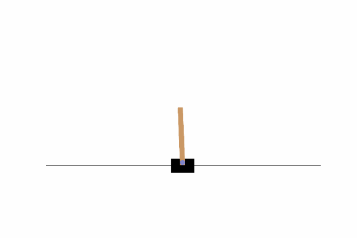
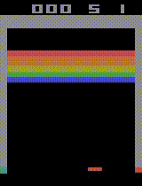
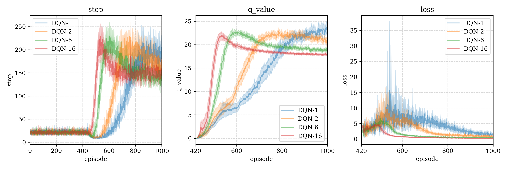

# KataRL

## Introduce 介绍

KataRL is a testing framework for reinforcement learning(RL), functions:

- Easy to train agent interacts with the specified environment (gym), only change the bash command.
- Use [Weight and Bias(wandb)](https://wandb.ai/) to record and display the training logs.
- Model weights save and load.

---

Available models:

- DQN (Deep Q-Learning Network) [[algo & experiment](https://wty-yy.space/posts/42683/)]
- A2C (Advantage Actor-Critic) [[algo & experiment](https://wty-yy.space/posts/6031/)]
- PPO (Proximal Policy Optimization) [[algo & experiment](https://wty-yy.space/posts/529/)]
- SAC (Soft Actor-Critic) [[algo & experiment](https://wty-yy.space/posts/10763/)]

Tested environment：

- `CartPole-v1` ([Gymnasium - cartpole](https://gymnasium.farama.org/environments/classic_control/cart_pole/)) Following `gif` isgenerated by A2C.
- `Acrobot-v1`（[Gymnasium - Acrobot](https://gymnasium.farama.org/environments/classic_control/acrobot/)）Following `gif` is generatedd by PPO.
- `BreakoutNoFrameskip-v4` ([Gymnasium - breakout](https://gymnasium.farama.org/environments/atari/breakout/#breakout)) Following `gif` is generatedd by PPO.

<div style="display: flex; flex-wrap: nowrap; justify-content: space-between;">
    
    
    
</div>
### Get started

Prerequisites:

- Python >= 3.7.1

Install with `requirements-jax.txt`：

```bash
pip install -r requirements/requirement-jax.txt
```

In order to read the python path, the test program must be run in the root directory：

```shell
python katarl/run/ppo/ppo.py -h  # help doc for the params parser
python katarl/run/ppo/ppo.py --train  # training with default params
python katarl/run/ppo/ppo.py --train --wandb-track  # track with wandb
python katarl/run/ppo/ppo_atari.py --train --capture-video  # training in atari envs and capture videos
python katarl/run/dqn/ddqn.py --train --seed 2  # set the seed
python katarl/run/a2c/a2c.py --train --wandb-track --env-name Acrobot-v1  # change the envs
```

Compare different algorithm in` wandb` report:

<iframe src="https://wandb.ai/wty-yy/KataRL/reports/Algorithms-compare--Vmlldzo1MjY2MzIz?accessToken=tk6rtagmfq5mbwyvf242jc1obg04rf2tym8a779nvc5c0l1on0zt48zz90eobwfz" style="border:none;height:1024px;width:100%">


---

The following are old functions:

- Periodically display the training status.

  ```shell
  # plot cyclely (-pc) status from agent_name='DQN-1' (-m) agent_id=0 (-i)
  python plot.py -m 'DQN-1' -i 0 -pc
  # plot file will be saved at './logs/figures/{current-timestamp}.png'
  ```

- Plot the training graph of multi-restarts for the same Agent and Environment. (with 95% confident interval)

  ```shell
  # logs_path="train-logs/DQN-logs" (-p), model_names=["DQN-1","DQN-2","DQN-6","DQN-16"] (-m)
  # plot alpha=0.5 (-a), dpi=300 (-dpi)
  python plot_merge.py -p "train-logs/DQN-logs" -m "DQN-1" "DQN-2" "DQN-6" "DQN-16" -a 0.5 -dpi 300
  ```
  
  

## Framework 框架架构

Tree file diagram generation code in shell:

shell中树形文件图生成代码：`tree -f -I "__pycache__|*logs|LICENSE|*.md|*.txt|test*" .`

```shell
RL-framework
├── ./archives*  "Save some figures"
├── ./agents  "Agent algorithms package"
│   ├── ./agents/__init__.py  "Agent class(parent)"
│   ├── ./agents/DQN.py  "DQN algorithm"
│   ├── ./agents/constants  "hyper-params package"
│   │   ├── ./agents/constants/__init__.py  "General hyper-params"
│   │   └── ./agents/constants/DQN.py  "DQN hyper-params"
│   └── ./agents/models  "Models package"
│       └── ./agents/models/__init__.py  "Model class(parent)"
├── ./envs  "Environment package"
│   ├── ./envs/__init__.py  "Environment class(parent)"
│   └── ./envs/gym_env.py  "openai-gymnasium"
|── ./utils  "General func"
|	├── ./utils/__init__.py  "Common func"
|   ├── ./utils/generate_gif.py  "Generate gif from frames"
|   ├── ./utils/history.py  "History class"
|   └── ./utils/logs_manager.py  "LogsManager and Logs class"
|── ./run  "Run algorithm test"
|	├── ./run/DQN  "DQN"
│   │   └── ./run/DQN/cartpole.py  "DQN in Cartpole Env"
|   └── ./run/A2C  "Advantage Actor-Critic"
│       └── ./run/A2C/cartpole.py  "A2C in Cartpole Env"
├── ./main.py  "Main test interface, call test function in ./run/model.py"
├── ./plot.py  "PlotManager class (use argparse to call)"
├── ./plot_merge.py  "Plot merge logs figure (use argparse to call)"
└── ./train-logs*  "Algorithm training logs"
```

