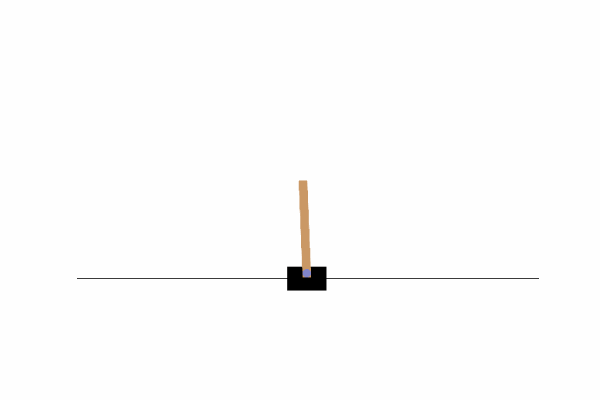
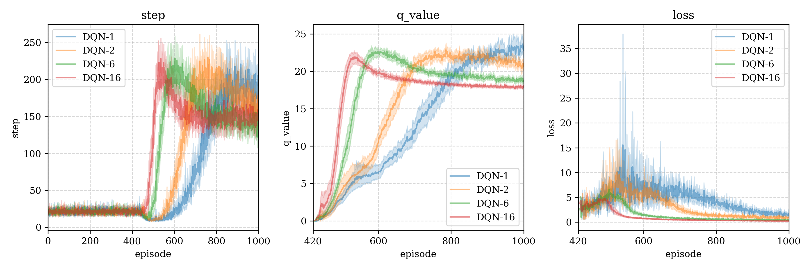

# RL-Framework

## Introduce 介绍

A testing framework for reinforcement learning, support function:

一个用于强化学习模型测试框架，支持以下功能：

- Agent interacts with Environment 智能体与环境交互
- Training parameters record 训练参数的记录
- Model weights save and callback 模型权重保存及回调
- Draw log images 绘制日志图像

To be adding 待添加：

- [ ] Multi-Agent 多智能体

---

Available models includes 当前包含模型：

- DQN (Deep Q-Learning Network) [[info & env test](archives/algorithms/DQN/DQN (Deep Q-Network).md)]
- A2C (Advantage Actor-Critic) [info & env test]

Tried environment 尝试过的环境：

- `CartPole-v1` ([Gymnasium - Information](https://gymnasium.farama.org/environments/classic_control/cart_pole/)) Following `gif` is a great policy (500 steps) generated by A2C.

  

**Instruction 运行方法**：

In order to read the python path, the main program must be run in the root directory, call the algorithm test from the main program, for example:

为了能够读取路径，必须在根目录下运行主程序，从主程序中调用算法测试，例如：

```shell
python main.py  # /main.py

# --- 'main.py' ---
# from run.DQN.cartpole import DQN_cartpole  # Your test model
# 
# if  __name__ == '__main__':
#     DQN_cartpole()
```

**Frame function example 框架功能栗子：**

- Train the Agent in the specified training environment. 在指定的训练环境下训练智能体。

  ```python
  def DQN_cartpole:  # /run/DQN/cartpole.py
      dqn = DQN(
          agent_name='DQN-4',
          model=MLP(),  # The model used in DQN
          env=GymEnv(name="CartPole-v1", render_mode="rgb_array"),  # Environment CartPole
          verbose=False, agent_id=idx, episodes=1000, load_id=None,  # extends Agent's attribs
          batch_size=4  # Agent's hyper-args
      )
      dqn.train()
  ```

- Periodically display the training status. 周期性显示训练状态。

  ```shell
  # plot cyclely (-pc) status from agent_name='DQN-1' (-m) agent_id=0 (-i)
  python plot.py -m 'DQN-1' -i 0 -pc
  # plot file will be saved at './logs/figures/{current-timestamp}.png'
  ```

- Plot the training graph of multi-restarts for the same Agent and Environment. (with 95% confident interval)

  绘制相同智能体和环境下多次重启的训练曲线图。（带95%置信区间）

  ```shell
  # logs_path="train-logs/DQN-logs" (-p), model_names=["DQN-1","DQN-2","DQN-6","DQN-16"] (-m)
  # plot alpha=0.5 (-a), dpi=300 (-dpi)
  python plot_merge.py -p "train-logs/DQN-logs" -m "DQN-1" "DQN-2" "DQN-6" "DQN-16" -a 0.5 -dpi 300
  ```

  


### Test 测试结果

## Framework 框架架构

Tree file diagram generation code in shell:

shell中树形文件图生成代码：`tree -f -I "__pycache__|*logs|LICENSE|*.md|*.txt|test*" .`

```shell
RL-framework
├── ./archives*  "Save some figures"
├── ./agents  "Agent algorithms package"
│   ├── ./agents/__init__.py  "Agent class(parent)"
│   ├── ./agents/DQN.py  "DQN algorithm"
│   ├── ./agents/constants  "hyper-params package"
│   │   ├── ./agents/constants/__init__.py  "General hyper-params"
│   │   └── ./agents/constants/DQN.py  "DQN hyper-params"
│   └── ./agents/models  "Models package"
│       └── ./agents/models/__init__.py  "Model class(parent)"
├── ./envs  "Environment package"
│   ├── ./envs/__init__.py  "Environment class(parent)"
│   └── ./envs/gym_env.py  "openai-gymnasium"
|── ./utils  "General func"
|	├── ./utils/__init__.py  "Common func"
|   ├── ./utils/generate_gif.py  "Generate gif from frames"
|   ├── ./utils/history.py  "History class"
|   └── ./utils/logs_manager.py  "LogsManager and Logs class"
|── ./run  "Run algorithm test"
|	├── ./run/DQN  "DQN"
│   │   └── ./run/DQN/cartpole.py  "DQN in Cartpole Env"
|   └── ./run/A2C  "Advantage Actor-Critic"
│       └── ./run/A2C/cartpole.py  "A2C in Cartpole Env"
├── ./main.py  "Main test interface, call test function in ./run/model.py"
├── ./plot.py  "PlotManager class (use argparse to call)"
├── ./plot_merge.py  "Plot merge logs figure (use argparse to call)"
└── ./train-logs*  "Algorithm training logs"
```

