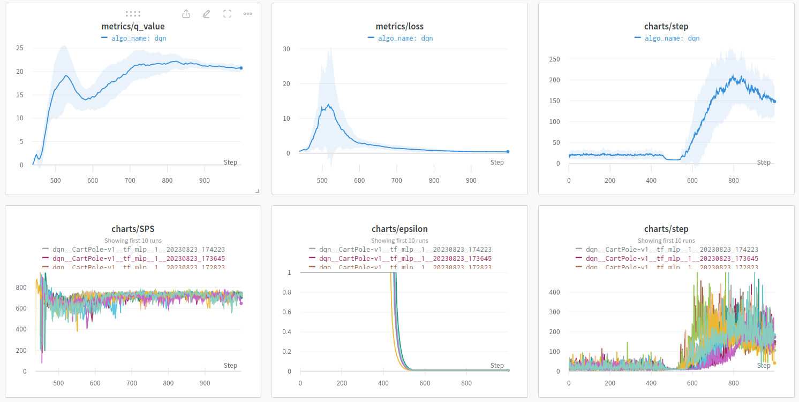

# RL-Framework

## Introduce 介绍

A testing framework for reinforcement learning, support function:

一个用于强化学习模型测试框架，支持以下功能：

- Agent interacts with Environment 智能体与环境交互
- Training parameters record 训练参数的记录
- Model weights save and callback 模型权重保存及回调
- Draw log images 绘制日志图像

To be adding 待添加：

- [ ] Multi-Agent 多智能体

---

Available models includes 当前包含模型：

- DQN (Deep Q-Learning Network) [[info & experiment](https://wty-yy.space/posts/42683/)]
- A2C (Advantage Actor-Critic) [[info & experiment](https://wty-yy.space/posts/6031/)]
- PPO (Proximal Policy Optimization) [info & experiment](https://wty-yy.space/posts/529/)

Tried environment 尝试过的环境：

- `CartPole-v1` ([Gymnasium - Information](https://gymnasium.farama.org/environments/classic_control/cart_pole/)) Following `gif` is a great policy (500 steps) generated by A2C.

  

- `Breakout-v4` ([Gymnasium - breakout](https://gymnasium.farama.org/environments/atari/breakout/#breakout)) Following `gif` is generatedd by PPO:

  

**Instruction 运行方法**：

In order to read the python path, the test program must be run in the root directory, use `-h` to check all parse args:

为了能够读取路径，必须在根目录下调用测试程序，使用 `-h` 查看测试的所有参数：

```shell
python run/DQN/dqn.py --train --wandb-track  # training the dqn
python run/DQN/dqn.py -h  # check all params
```

**Frame function example 框架功能栗子：**

- Train the Agent in the specified training environment. 在指定的训练环境下训练智能体。

  ```python
  from agents.models.DQN.tf_mlp import Model  # /run/DQN/dqn.py
  env = GymEnv(name="CartPole-v1")
  model = Model(
      lr=1e-3, load_name=None, load_id=None,
      input_shape=env.state_shape, output_ndim=env.action_ndim
  )
  dqn = DQN(
      agent_name=args.run_name, env=env, model=model, writer=writer, **vars(args)
  )
  dqn.train()
  ```

- Check logs at wandb online. 在加入 `--wandb-track` 后可以直接在网页上查看实时训练结果 [link](https://api.wandb.ai/links/wty-yy/uftzvtm6)。

  

---

The following are legacy functions 以下为旧版功能

- Periodically display the training status. 周期性显示训练状态。

  ```shell
  # plot cyclely (-pc) status from agent_name='DQN-1' (-m) agent_id=0 (-i)
  python plot.py -m 'DQN-1' -i 0 -pc
  # plot file will be saved at './logs/figures/{current-timestamp}.png'
  ```

- Plot the training graph of multi-restarts for the same Agent and Environment. (with 95% confident interval)

  绘制相同智能体和环境下多次重启的训练曲线图。（带95%置信区间）

  ```shell
  # logs_path="train-logs/DQN-logs" (-p), model_names=["DQN-1","DQN-2","DQN-6","DQN-16"] (-m)
  # plot alpha=0.5 (-a), dpi=300 (-dpi)
  python plot_merge.py -p "train-logs/DQN-logs" -m "DQN-1" "DQN-2" "DQN-6" "DQN-16" -a 0.5 -dpi 300
  ```

  

## Framework 框架架构

Tree file diagram generation code in shell:

shell中树形文件图生成代码：`tree -f -I "__pycache__|*logs|LICENSE|*.md|*.txt|test*" .`

```shell
RL-framework
├── ./archives*  "Save some figures"
├── ./agents  "Agent algorithms package"
│   ├── ./agents/__init__.py  "Agent class(parent)"
│   ├── ./agents/DQN.py  "DQN algorithm"
│   ├── ./agents/constants  "hyper-params package"
│   │   ├── ./agents/constants/__init__.py  "General hyper-params"
│   │   └── ./agents/constants/DQN.py  "DQN hyper-params"
│   └── ./agents/models  "Models package"
│       └── ./agents/models/__init__.py  "Model class(parent)"
├── ./envs  "Environment package"
│   ├── ./envs/__init__.py  "Environment class(parent)"
│   └── ./envs/gym_env.py  "openai-gymnasium"
|── ./utils  "General func"
|	├── ./utils/__init__.py  "Common func"
|   ├── ./utils/generate_gif.py  "Generate gif from frames"
|   ├── ./utils/history.py  "History class"
|   └── ./utils/logs_manager.py  "LogsManager and Logs class"
|── ./run  "Run algorithm test"
|	├── ./run/DQN  "DQN"
│   │   └── ./run/DQN/cartpole.py  "DQN in Cartpole Env"
|   └── ./run/A2C  "Advantage Actor-Critic"
│       └── ./run/A2C/cartpole.py  "A2C in Cartpole Env"
├── ./main.py  "Main test interface, call test function in ./run/model.py"
├── ./plot.py  "PlotManager class (use argparse to call)"
├── ./plot_merge.py  "Plot merge logs figure (use argparse to call)"
└── ./train-logs*  "Algorithm training logs"
```

