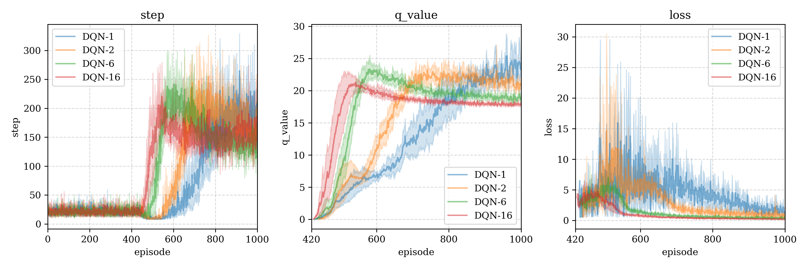

# RL-Framework

## Introduce 介绍

A testing framework for reinforcement learning, available models includes:

一个用于强化学习模型测试框架，当前包含模型：

- DQN

**Framework function 框架功能：**

- Train the Agent in the specified training environment. 在指定的训练环境下训练智能体。

  ```python
  dqn = DQN(
      agent_name=f'DQN-1',
      env=GymEnv(name="CartPole-v1", render_mode="rgb_array"),
      verbose=False, agent_id=0, episodes=1000, load_id=None,
      batch_size=1
  )
  dqn.train()
  ```

- Periodically display the training status. 周期性显示训练状态。

  ```shell
  # plot cyclely (-pc) status from agent_name='DQN-1' (-m) agent_id=0 (-i)
  python plot.py -m 'DQN-1' -i 0 -pc
  # plot file will be saved at './logs/figures/{current-timestamp}.png'
  ```

- Plot the training graph of multi-restarts for the same Agent and Environment. (with 95% confident interval)

  绘制相同智能体和环境下多次重启的训练曲线图。（带95%置信区间）

  ```shell
  # logs_path="train-logs/DQN-logs" (-p), model_names=["DQN-1","DQN-2","DQN-6","DQN-16"] (-m)
  # plot alpha=0.5 (-a), dpi=300 (-dpi)
  python plot_merge.py -p "train-logs/DQN-logs" -m "DQN-1" "DQN-2" "DQN-6" "DQN-16" -a 0.5 -dpi 300
  ```

  

  

## Framework 框架架构

Tree file diagram generation code in shell:

shell中树形文件图生成代码：`tree -f -I "__pycache__|*logs|LICENSE|*.md|*.txt|test*" .`

```shell
RL-framework
├── ./agents  "Agent algorithms package"
│   ├── ./agents/__init__.py  "Agent class(parent)"
│   ├── ./agents/DQN.py  "DQN algorithm"
│   ├── ./agents/constants  "hyper-params package"
│   │   ├── ./agents/constants/__init__.py  "General hyper-params"
│   │   └── ./agents/constants/DQN.py  "DQN hyper-params"
│   └── ./agents/models  "Models package"
│       ├── ./agents/models/__init__.py  "Model class(parent)"
│       ├── ./agents/models/MLP.py  "MLP model"
│       └── ./agents/models/utils.py  "General func"
├── ./envs  "Environment package"
│   ├── ./envs/__init__.py  "Environment class(parent)"
│   └── ./envs/gym_env.py  "openai-gymnasium"
|── ./utils  "General func"
|	├── ./utils/__init__.py  "Common func"
|   ├── ./utils/generate_gif.py  "Generate gif from frames"
|   ├── ./utils/history.py  "History class"
|   └── ./utils/logs_manager.py "LogsManager and Logs class"
├── ./plot.py  "PlotManager class"
├── ./run.py  "Algorithm run test"
└── ./train-logs*  "Algorithm training logs"
```

