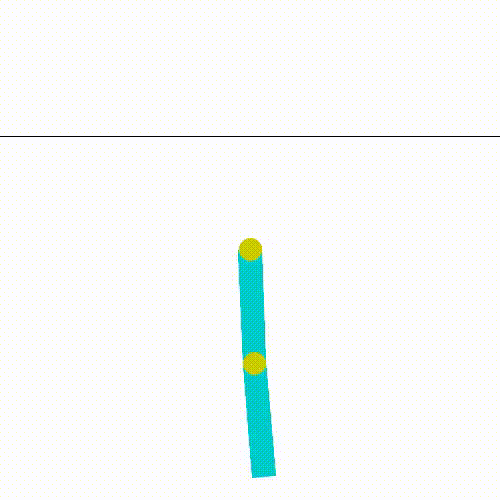
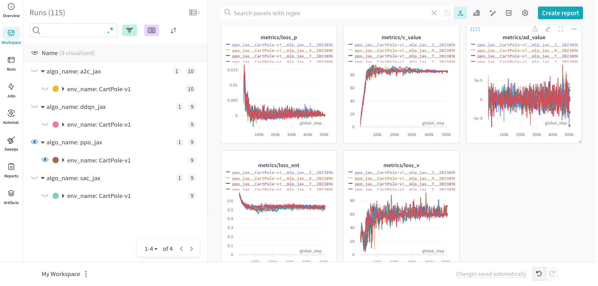

# KataRL

## Introduce

KataRL is a testing framework for reinforcement learning(RL), functions:

- Easy to train agent interacts with the specified environment (gym), only change the shell command.
- Use [Weight and Bias(wandb)](https://wandb.ai/) to record and display the training logs.
- Model weights save and load.

> thanks [cleanrl](https://github.com/vwxyzjn/cleanrl), it provides a clean RL code, and helped me fix many bugs.

---

Available models:

- DQN (Deep Q-Learning Network) [[algo & experiment](https://wty-yy.space/posts/42683/)]
- A2C (Advantage Actor-Critic) [[algo & experiment](https://wty-yy.space/posts/6031/)]
- PPO (Proximal Policy Optimization) [[algo & experiment](https://wty-yy.space/posts/529/)]
- SAC (Soft Actor-Critic) [[algo & experiment](https://wty-yy.space/posts/10763/)]

Tested environment：

- `CartPole-v1` ([Gymnasium - cartpole](https://gymnasium.farama.org/environments/classic_control/cart_pole/)) Following `gif` isgenerated by A2C.
- `Acrobot-v1`（[Gymnasium - Acrobot](https://gymnasium.farama.org/environments/classic_control/acrobot/)）Following `gif` is generatedd by PPO.
- `BreakoutNoFrameskip-v4` ([Gymnasium - breakout](https://gymnasium.farama.org/environments/atari/breakout/#breakout)) Following `gif` is generatedd by PPO.

<div style="display: flex; flex-wrap: nowrap; justify-content: space-between;">
    
    
    
</div>

Compare different algorithms in `wandb` [report](https://api.wandb.ai/links/wty-yy/pomv4d9r):


### Get started

Prerequisites:

- Python >= 3.7.1

Install with `requirements-jax.txt`：

```shell
pip install -r requirements/requirement-jax.txt
```

In order to read the python path, the test program must be run in the root directory：

```shell
python katarl/run/ppo/ppo.py -h  # help doc for the params parser
python katarl/run/ppo/ppo.py --train  # training with default params
python katarl/run/ppo/ppo.py --train --wandb-track  # track with wandb
python katarl/run/ppo/ppo_atari.py --train --capture-video  # training in atari envs and capture videos
python katarl/run/dqn/ddqn.py --train --seed 2  # set the seed
python katarl/run/a2c/a2c.py --train --wandb-track --env-name Acrobot-v1  # change the envs
```

Check logs with `--wandb-track` in real time:

<div style="display: flex; flex-wrap: nowrap; justify-content: space-between;">
    
    
</div>

---

## Framework struct

Tree file diagram generation code in shell: `tree -f -I "__pycache__|*logs|LICENSE|*.md|*.txt|test*|wandb" . `

```shell
.
├── ./archives*  "Figures"
├── ./requirements  "Requirement packages"
├── ./katarl
│   ├── ./katarl/agents  "Algorithms"
│   │   ├── ./katarl/agents/__init__.py
│   │   ├── ./katarl/agents/a2c_jax.py
│   │   ├── ./katarl/agents/a2c_tf.py
│   │   ├── ./katarl/agents/ddqn_jax.py
│   │   ├── ./katarl/agents/ddqn_tf.py
│   │   ├── ./katarl/agents/dqn_tf.py
│   │   ├── ./katarl/agents/ppo_jax.py
│   │   ├── ./katarl/agents/ppo_tf.py
│   │   ├── ./katarl/agents/sac_jax.py
│   │   ├── ./katarl/agents/constants  "Algo hyper-params"
│   │   │   ├── ./katarl/agents/constants/__init__.py
│   │   │   ├── ./katarl/agents/constants/a2c.py
│   │   │   ├── ./katarl/agents/constants/dqn*
│   │   │   ├── ./katarl/agents/constants/ppo*
│   │   │   └── ./katarl/agents/constants/sac*
│   │   └── ./katarl/agents/models  "networks"
│   │       ├── ./katarl/agents/models/base*
│   │       ├── ./katarl/agents/models/a2c*
│   │       ├── ./katarl/agents/models/dqn*
│   │       ├── ./katarl/agents/models/ppo*
│   │       └── ./katarl/agents/models/sac*
│   ├── ./katarl/envs  "Environments"
│   │   ├── ./katarl/envs/atari_wrappers.py
│   │   ├── ./katarl/envs/gym_env.py
│   │   └── ./katarl/envs/__init__.py
│   ├── ./katarl/run  "Start with shell command"
│   │   ├── ./katarl/run/a2c
│   │   │   └── ./katarl/run/a2c/a2c.py
│   │   ├── ./katarl/run/dqn
│   │   │   ├── ./katarl/run/dqn/ddqn.py
│   │   │   └── ./katarl/run/dqn/dqn.py
│   │   ├── ./katarl/run/ppo
│   │   │   ├── ./katarl/run/ppo/ppo_atari.py
│   │   │   └── ./katarl/run/ppo/ppo.py
│   │   └── ./katarl/run/sac
│   │       └── ./katarl/run/sac/sac.py
│   └── ./katarl/utils  "Some util packages"
│       ├── ./katarl/utils/logs.py
│       └── ./katarl/utils/parser.py
└── ./train_script.bash
```

