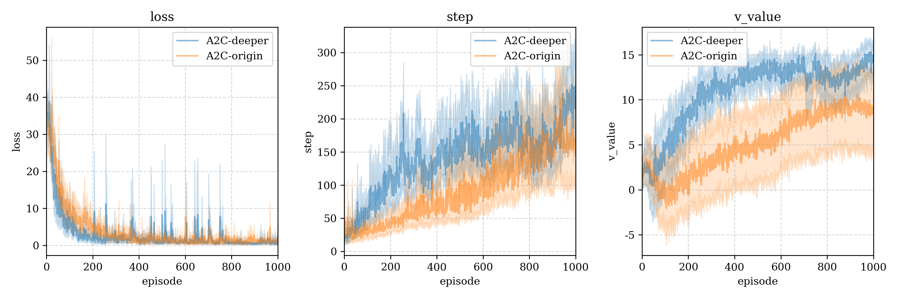
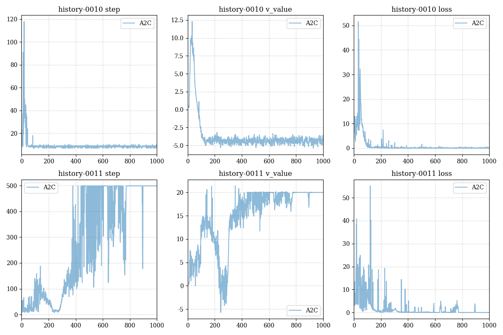
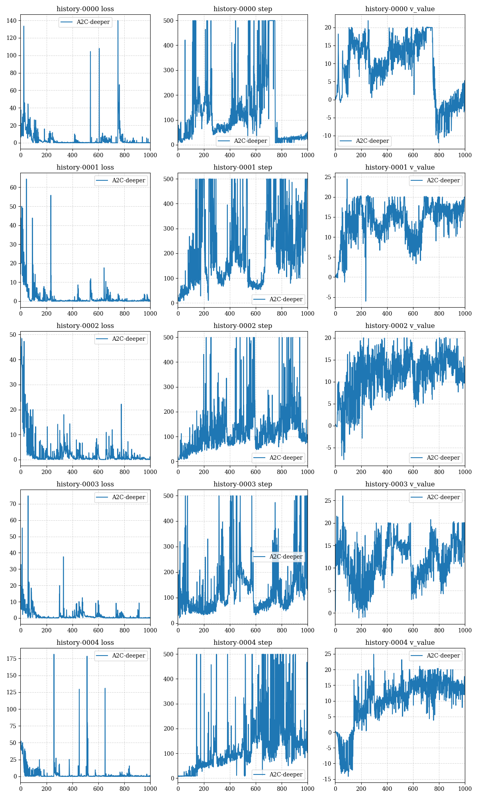

# A2C (Advantage Actor-Critic)

## Algorithm 算法

设 $\pi(a|s;\theta)$ 为当前智能体策略网络，其中 $\theta$ 为网络参数，$V_\pi(S)$ 为状态价值函数，最优化目标
$$
\max_\theta\mathbb{E}_S[V_{\pi}(S)] =: J(\theta)
$$
由带基线的策略梯度定理可知：
$$
\frac{\partial J(\theta)}{\partial \theta} =
\mathbb{E}_S[\mathbb{E}_{A\sim\pi(\cdot|S;\theta)}[(Q_{\pi}(S,A)) - V_{\pi}(S)\nabla_{\theta}\ln\pi(A|S;\theta)]]
$$
设 $v(s;w)$ 为对策略 $\pi(a|s;\theta)$ 的状态价值估计的网络，其中 $w$ 为网络参数，则对于四元组 $(s,a,r,s')$ ，由Bellman方程可知，$Q_\pi(s,a)$ 的近似为
$$
Q_\pi(s,a)\approx r + \gamma\cdot v(s';w)
$$
则近似策略梯度可以表示为：
$$
\frac{J(\theta)}{\partial\theta} \approx (r+\gamma\cdot v(s';w) - v(s;w))\nabla_\theta\pi(a|s;\theta)
$$

### Model Training 模型训练

对于由策略 $\pi(a|s;\theta)$ 走出的四元组 $(s,a,r,s')$，进行一下计算：

1. **TD target**: $\hat{y} = r + \gamma\cdot v(s';w)$
2. Loss: $\mathcal{L}(w) = \frac{1}{2}||v(s;w)-\hat{y}||_2^2 = \frac{1}{2}||\delta||_2^2$ where $\delta = v(s;w) - \hat{y}$ is the **TD error**
3. Approximate gradient: $g = (\hat{y}-v(s;w))\nabla_\theta\ln\pi(a|s;\theta) = -\delta\cdot\nabla_\theta\ln\pi(a|s;\theta)$

4. Update value network: $w\gets w - \alpha \frac{\partial\mathcal{L}(w)}{\partial w} = w - \alpha\delta\cdot \nabla_wv(s;w)$
5. Updata policy network: $\theta\gets\theta + \beta g = \theta - \beta\delta\cdot \nabla_{\theta}\ln\pi(a|s;\theta)$

## Environment test 环境测试

### Cartpole 平衡木

[Cartpole environment information - Gymnasium](https://gymnasium.farama.org/environments/classic_control/cart_pole/)

#### Hyper-parameters 超参数

**Agent**

1. model struct:
   1. Input(4)-Dense(32)-Dense(32)-Output (We call it **origin** one)
   2. Input(4)-Dense(128)-Dense(64)-Dense(16)-Output (We call it **deeper** one)

2. model optimizer & learning rate (After multi test, get the best args, maybe~)
   1. Adam: $\alpha=10^{-3}, \beta=10^{-5}$
   2. SGD: $\alpha=5\times 10^{-4}, \beta = 10^{-4}$

**Environment**

1. positive reward $r_{pos} = 1$
2. negative reward $r_{neg} = -10$ and $-20$ (compare)

#### Test result 1 测试结果1

We try different model struct, origin and deeper model, after compare, we found the deeper is almost rolling the origin one.

我们尝试测试origin和deeper两种模型，更深的模型几乎完全碾压了浅的模型。

#### Test result 2 测试结果2

We also find the deeper model can avoid complete failure of the policy since random environment，this is the result of restarting the origin model twice: (one almost dead, and the other is powerful)

我们还发现更深的模型可以避免因环境随机性导致策略完全失效，以下是我们重启origin模型两侧得到的完全不同的两个结果（其中一个几乎无法走出10步，而另一个几乎获得了最优策略）

The training results of 5 restarts of the deeper model are given below:

以下给出了5次重启deeper model的训练结果：

