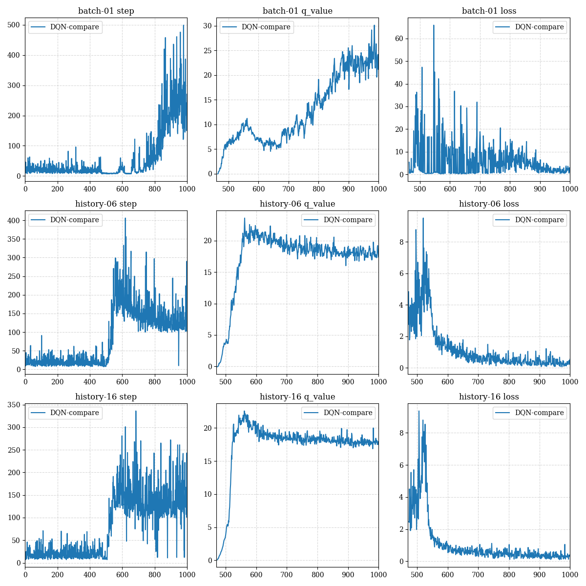
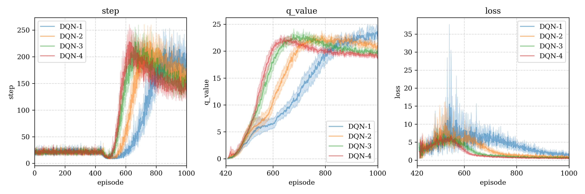
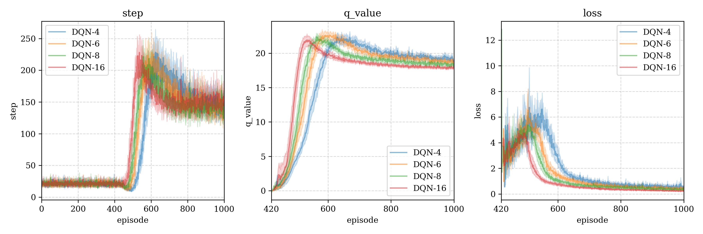
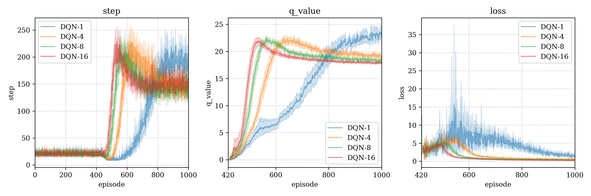

# DQN (Deep Q-Network)

## Algorithm 算法

DQN is based on Q-Learning, it changes the estimate of the Q function from "grid search" to "network search". It's an off-policy algorithm, which allow us to store past tracks in memory and replay them during model training. Based on optimal Bellman equation and TD method to update model, the optimal Bellman function is:
$$
Q_*(S,A) = \mathbb{E}_{S'\sim p(\cdot|S,A)}[R(S,A)+\gamma \max_{a\in\mathcal{A}}Q_*(S',a)|S,A]
$$
DQN基于Q-Learning算法，它将对Q函数估计，从“网格搜索”改为“网络搜索”。这是一种离轨算法，因此我们可以将过去的轨迹存储在记忆中，并在训练模型时进行回放。模型的更新基于最优Bellman方程和TD方法，最优Bellman方程如上所示。

### Implementation 具体步骤

#### $\varepsilon$-greedy policy $\varepsilon$-贪心策略

We use $\varepsilon$-greedy policy as action policy to interact with the environment, and store the tracks in memory.

我们使用$\varepsilon$-贪心策略作为行动策略，用于和环境的交互，并将交互的轨迹记录在记忆当中。

Let the action space $\mathcal{A} = \{a_1,a_2,\cdots, a_{|\mathcal{A}|}\}$, the following is  $\varepsilon$-greedy:
$$
\pi_{\varepsilon}(a|s) = \begin{cases}
1-\varepsilon, &\quad a=\arg\max\limits_{a\in\mathcal{A}}q(s,a;w)\\
\dfrac{\varepsilon}{|\mathcal{A}|},&\quad a_i\in\mathcal{A}, \quad(i=1,2,...,|\mathcal{A}|)
\end{cases}
$$
where $q(s,a;w)$ is our Q value networks.

#### Memory 5-tuple 记忆五元组

Assume we get a 4-tuple from the environment $(s,a,r,s')$, let terminal signal $t = [s'\text{ is terminal state}]$ (if $s'$ is terminal then $t=1$, else $t=0$), combining this with 4-tuple give 5-tuple $(s,a,r,s',t)$. Define $M = \{(s,a,r,s',t)\}$ for the memory set, store all the 5-tuple when action policy interact with the environment.

假设我们从环境交互中得到四元组 $(s,a,r,s')$，令终止信号为 $t=[s'\text{是终止状态}]$（如果 $s'$ 终止，则 $t=1$，否则 $t=0$），将其和之前的四元组组合得到五元组 $(s,a,r,s',t)$。令 $M=\{(s,a,r,s',t)\}$ 为记忆集合，存储行动策略得到的所有五元组。

#### Model definition 模型定义

We define the state space is $\mathcal{S}$ and action space is $\mathcal{A}$. The model is used to approximate Q-value (Action value) function, denote the model as $q(s;w): \mathcal{S}\to \mathcal{A}$, where $w$ is the weights of the model. Although the Q-value function is $Q(s,a)$，we use the a-th dimension of outputs $q(s;w)_a=:q(s,a;w)$ to approximate it.

我们将动作空间记为 $\mathcal{S}$，动作空间记为 $\mathcal{A}$，模型将用于近似动作价值函数，记其为 $q(s;w):\mathcal{S}\to\mathcal{A}$，其中 $w$ 为模型的权重。虽然动作价值函数是 $Q(s,a)$，我们将用模型输出的第 $a$ 个维度信息 $q(s;w)_a=:q(s,a;w)$ 去近似它。

#### Model training 模型训练

We would set a `start_fit_size` at `/agents/constants/DQN.py`, means to start training only when the number of samples in memory exceeds `start_fit_size`, and train after each step.

我们在 `/agents/constants/DQN.py` 中设置了 `start_fit_size` 变量，其表示只有当记忆中的样本数目超过该大小时才开始训练，并在每次执行完一步后训练。

Training process 训练流程：

1. Random a batch of 5-tuple from memory $(s,a,r,s',t)\in M$ .
2. **TD target**: $\hat{y} = r + \gamma \max\limits_aq(s',a;w)$ .
3. Loss: $\mathcal{L}(w)=\frac{1}{2}||q(s,a;w)-\hat{y}||_2^2 = \frac{1}{2}||\delta||_2^2$ where $\delta = q(s,a;w) - \hat{y}$ is **TD error**.
4. Update: $w\gets w-\alpha\frac{\partial\mathcal{L}(w)}{\partial w} = w - \alpha\delta\nabla_wQ(s,a;w)$ .

## Environment test 环境测试

### Cartpole 平衡木

[Cartpole environment information - Gymnasium](https://gymnasium.farama.org/environments/classic_control/cart_pole/)

#### Hyper-parameters 超参数

1. model optimizer: Adam, learning rate $lr = 10^{-3}$

2. discount rate $\gamma=0.95$

3. $\varepsilon_{max}=1, \varepsilon_{min}=0.01, \varepsilon_{decay} = 0.995$
4. memory size $10^6$
5. start fit size $10^4$
6. batch size $[1,2,3,4,6,8,16]$

#### 测试结果1

We test different batch size, interestingly, only small batch size can reach the maximum number of steps (500 steps): 

我们尝试了不同的batch size大小，有趣的是，只有当小的batch大小才能达到最优步数（500步）：

#### 测试结果2

Following figures is average of multi-test with means and 95% confidence range (each test reset 30 times)

下图是多次重启得到的均值即95%置信区间（每一个重启30次）：

DQN-$i$ means the batch size is $i$，DQN-i表示使用了batch size为i进行测试。

